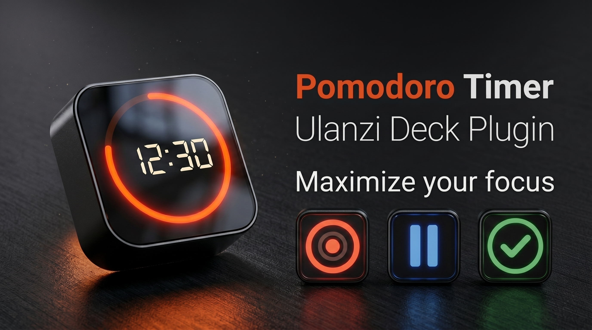
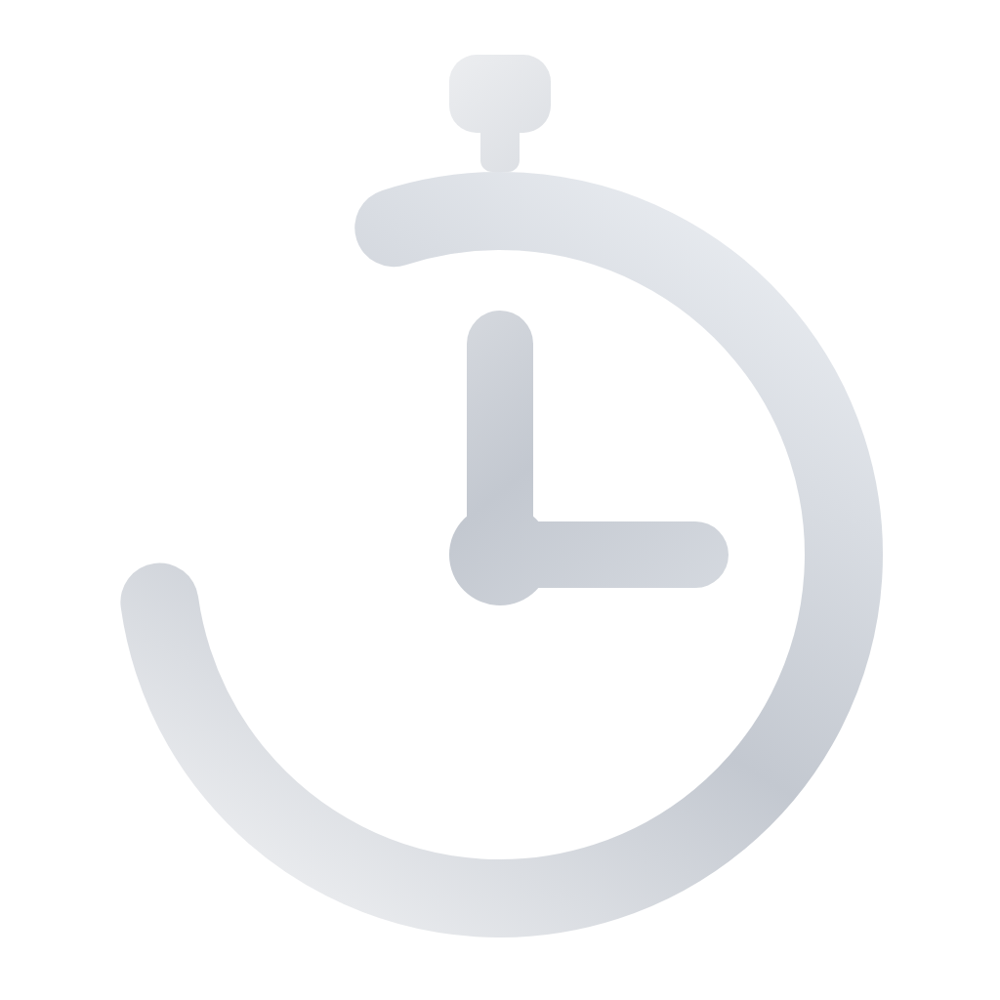

<p align="center">
  
  
</p>

<h1 align="center">Pomodoro Timer — Ulanzi Deck Plugin</h1>

<p align="center">
  A focus timer with a live progress ring, vector fonts, premium animations and desktop
  notifications — right on your Ulanzi Deck key.
</p>

<p align="center">
  
  
  
  
</p>

---

## ✨ Features

- **Live progress ring** — the ring drains as time runs out; minutes/seconds rendered as crisp **vector text** (works on any renderer).
- **Full Pomodoro flow** — focus → short break → focus … → long break → **green ✓ celebration**. Runs automatically; press the key only to pause/resume.
- **Progress dots** — show how many pomodoros are configured and how many you've completed.
- **9 themes** — Classic, Minimal, Neon, Ocean, Forest, Sunset, Dracula, Coffee, Mono — plus a **custom color picker**.
- **4 fonts** — Sans, Mono, Serif, Display (bundled OFL fonts, drawn as vector paths).
- **Ring animations** — None, Pulse, Comet, Sweep (frame-driven, premium minimalist).
- **Glossy text shimmer** — an "AI thinking" sweep across the timer, in a lighter shade of the active color.
- **Last-7s blink** — the key flashes to warn you the time is almost up.
- **Desktop notifications** — native toast on each phase end, with the plugin name + icon, localized.
- **Live preview** in the settings panel — see your exact configuration animate before applying.
- **Built-in tutorial** — explains the technique, color meanings and usage, in your language.
- **10 languages** — EN, PT-BR, PT-PT, ES, DE, FR, JA, KO, ZH-CN, ZH-HK.
- **Windows & macOS**.

---

## 🎨 Color guide

| Color | Phase | Meaning |
|------|-------|---------|
| 🔴 Red | **Focus** | Concentrated work time |
| 🟢 Green | **Short break** | Quick rest between focuses |
| 🔵 Blue | **Long break** | Longer rest after several pomodoros |
| 🟢 Green ✓ | **Done** | Full cycle complete (blinks 5s) |
| ⚪ Dimmed | **Paused** | Timer stopped |
| ⚡ Blinking | **Alert** | Last 7 seconds |

> Colors shown are the **Classic** theme — each theme has its own palette, and a custom color overrides them all.

---

## 📦 Installation

1. Copy the `com.pomodoro.timer.ulanziPlugin` folder into your Ulanzi plugins directory:
   - **Windows:** `%AppData%\Ulanzi\UlanziDeck\Plugins\`
   - **macOS:** `~/Library/Application Support/Ulanzi/UlanziDeck/Plugins/`
2. Fully **quit** Ulanzi Studio from the system tray and relaunch.
3. Drag **Pomodoro Timer** onto any key.

> Cloning the repo? Run `npm install` inside the plugin folder to fetch `ws` + `opentype.js`.

### 🍎 macOS notifications (optional)

Windows shows the toast with the plugin's name and icon out of the box. On macOS the
notification banner's name/icon come from the app that posts it, so for a richer
notification install **terminal-notifier** (MIT, open source):

```sh
brew install terminal-notifier
```

The plugin auto-detects it and then shows the **per-phase icon** + **Glass** sound on
each notification. If it isn't installed, the plugin falls back to `osascript`
(notification still works — title + message — just with a generic app attribution).

To get the **plugin name + a custom app icon** in the banner (full Windows parity), a
signed/rebranded helper bundle is required — step-by-step in
[`com.pomodoro.timer.ulanziPlugin/assets/mac/README.md`](com.pomodoro.timer.ulanziPlugin/assets/mac/README.md).

> First time, macOS may ask to allow notifications — **System Settings → Notifications**.

---

## ▶️ Usage

- **Press the key** → start / pause / resume.
- The flow continues automatically; it only pauses when you press the key.
- Open the key's **settings panel** to configure:
  - Focus / short break / long break durations
  - Pomodoros before a long break
  - Theme, font, ring animation, glossy text, custom color
  - Desktop notifications
  - **Reset Timer** and **Tutorial** buttons

---

## ⚙️ Tech

- Backend: Node.js service over WebSocket (`ws`).
- Timer digits drawn as **vector paths** via `opentype.js` + bundled OFL fonts (Roboto / Roboto Mono / Roboto Slab / Orbitron) — so the font actually changes on the deck rasterizer.
- Key images are generated **frame by frame** as base64 SVG.
- **Windows** toasts use a registered AppUserModelID (Start Menu shortcut) so the notification shows the plugin's localized name + icon.
- **macOS** uses `terminal-notifier` when available (per-phase icon), otherwise `osascript`.

---

## 🌐 Languages

English · Português (BR/PT) · Español · Deutsch · Français · 日本語 · 한국어 · 简体中文 · 繁體中文

---

## 👤 Author

**Jean Almeida**

[](https://www.linkedin.com/in/jeanc-almeida/)
[](https://github.com/JEAN-ALMEIDA-CZO)
[](https://portifolio.athos.app.br/)

---

## 📄 License

MIT © Jean Almeida — see [`com.pomodoro.timer.ulanziPlugin/LICENSE`](com.pomodoro.timer.ulanziPlugin/LICENSE).

Bundled fonts and libraries are under their own licenses — see [`THIRD-PARTY-LICENSES.md`](com.pomodoro.timer.ulanziPlugin/THIRD-PARTY-LICENSES.md).
